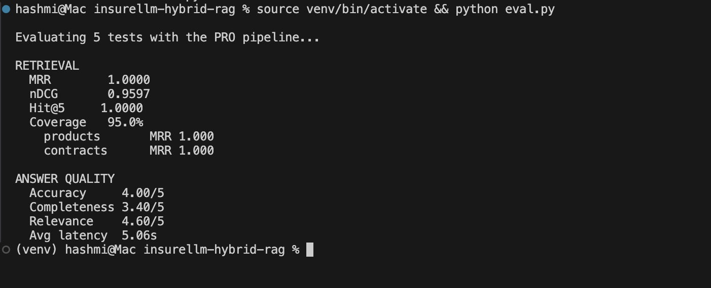

# Insurellm Hybrid RAG

An end-to-end **Retrieval-Augmented Generation (RAG)** system built for Insurellm, a fictional insurance tech company. The system lets users ask natural language questions and get grounded, accurate answers from a private knowledge base of 76 documents covering products, contracts, employees, and company information.

Achieved **MRR of 1.0 and Hit@5 of 1.0** on the evaluation suite, with answer accuracy of **4.2/5** and average latency of **4 seconds**.


---

## Architecture

```
User Question
     │
     ▼
┌─────────────────────────────────────────┐
│              Hybrid Retrieval           │
│                                         │
│  Dense Search (OpenAI Embeddings)       │
│       +                                 │
│  Sparse Search (BM25)                   │
│       │                                 │
│  Reciprocal Rank Fusion (RRF)           │
└─────────────────┬───────────────────────┘
                  │
                  ▼
        LLM Reranker (gpt-4.1-mini)
                  │
                  ▼
        Answer Generation (gpt-4.1-mini)
                  │
                  ▼
            Grounded Answer
```

**Key design choices:**
- **Hybrid search** (dense + sparse) outperforms either alone, dense catches semantic similarity, BM25 catches exact keyword matches
- **Reciprocal Rank Fusion** merges both result lists without needing score normalisation
- **LLM reranker** re-orders the top-K chunks by relevance before passing to the generator, significantly improving accuracy
- **AI-powered chunking** uses an LLM (gpt-4.1-nano) to split documents into semantically coherent chunks with 25% overlap, rather than naive character splitting

---

## Features

- Hybrid dense + sparse retrieval with RRF fusion
- AI-powered document chunking with overlap
- LLM-based reranking of retrieved context
- Multi-turn conversation with chat history
- Retrieved context panel shown alongside answers
- Evaluation pipeline with MRR, nDCG, Hit Rate, and LLM-as-judge scoring
- Chunk caching to avoid redundant LLM calls during ingestion
- Configurable models and retrieval parameters via `.env`

---

## Tech Stack

| Component | Technology |
|---|---|
| Embeddings | OpenAI `text-embedding-3-large` |
| Vector Store | ChromaDB (local, persistent) |
| Sparse Search | BM25 (rank-bm25) |
| LLM Calls | LiteLLM (model-agnostic) |
| Generation Model | `gpt-4.1-mini` (configurable) |
| Chunking Model | `gpt-4.1-nano` |
| UI | Gradio |
| Validation | Pydantic |
| Retry Logic | Tenacity |

---

## Project Structure

```
insurellm-hybrid-rag/
├── knowledge-base/          # 76 source documents
│   ├── company/             # About, overview, culture, careers
│   ├── contracts/           # Client contracts per product
│   ├── employees/           # Employee profiles
│   └── products/            # Product descriptions (8 products)
├── ingest.py                # Chunk documents and build vector store
├── retrieve.py              # Hybrid search + reranking
├── answer.py                # Answer generation with chat history
├── eval.py                  # Evaluation pipeline
├── app.py                   # Gradio chat UI
├── config.py                # Centralised configuration
└── test.py                  # Test question loader
```

---

## Evaluation Results

Evaluated on 5 questions across product and contract categories:

| Metric | Score |
|---|---|
| MRR | 1.00 |
| nDCG | 0.96 |
| Hit@5 | 1.00 |
| Keyword Coverage | 95% |
| Answer Accuracy | 4.0 / 5 |
| Completeness | 3.4 / 5 |
| Relevance | 4.6 / 5 |
| Avg Latency | 5.06s |



---

## Setup

**1. Clone and create a virtual environment**
```bash
git clone https://github.com/imhashmi8/insurellm-hybrid-rag.git
cd insurellm-hybrid-rag
python3 -m venv venv
source venv/bin/activate
pip install -r requirements.txt
```

**2. Configure environment variables**
```bash
cp .env.cloud .env
# Edit .env and add your OpenAI API key
```

`.env` variables:
```
OPENAI_API_KEY=sk-...
GEN_MODEL=openai/gpt-4.1-mini
CHUNK_MODEL=openai/gpt-4.1-nano
JUDGE_MODEL=openai/gpt-4.1-nano
RERANKER=llm   # options: llm | cross | none
```

**3. Ingest the knowledge base**
```bash
python ingest.py
```

**4. Launch the chat UI**
```bash
python app.py
```

**5. Run evaluation (optional)**
```bash
python eval.py
```

---

## How It Works

### Ingestion (`ingest.py`)
Each document is sent to an LLM with instructions to split it into overlapping chunks. Each chunk gets a headline, summary, and the original text. Chunks are cached by content hash so re-ingestion is fast. Embeddings are created in batches and stored in ChromaDB.

### Retrieval (`retrieve.py`)
For each query, both dense (embedding cosine similarity) and sparse (BM25 token overlap) searches are run independently. Results are merged using Reciprocal Rank Fusion. The top-K chunks are then passed to an LLM reranker that re-orders them by relevance to the question.

### Generation (`answer.py`)
The top chunks are formatted as context and passed to the generation model alongside the conversation history. The model is instructed to ground every claim in the provided extracts and say "I don't know" if the answer isn't there.

### Evaluation (`eval.py`)
Retrieval quality is measured with MRR, nDCG, and Hit Rate against gold-labeled source documents. Answer quality is scored by an LLM judge on accuracy, completeness, and relevance against reference answers.

---

## Configuration

All key parameters are configurable without code changes:

| Variable | Default | Description |
|---|---|---|
| `GEN_MODEL` | `openai/gpt-4.1-mini` | Model for answering and reranking |
| `CHUNK_MODEL` | `openai/gpt-4.1-nano` | Model for document chunking |
| `JUDGE_MODEL` | `openai/gpt-4.1-nano` | Model for eval scoring |
| `RERANKER` | `llm` | `llm`, `cross` (CrossEncoder), or `none` |
| `RETRIEVE_K` | `10` | Candidates retrieved per search |
| `FINAL_K` | `5` | Chunks passed to the generator |

Since models are routed through LiteLLM, you can swap in any supported provider (Anthropic, Groq, Azure, etc.) by changing the model string in `.env`.
